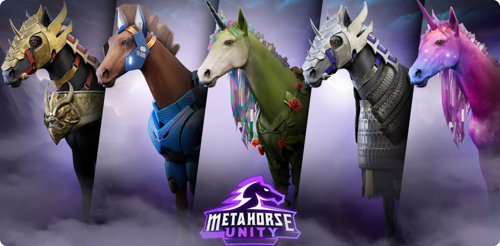

# MetaHorse Staking

<p align="center">
  
</p>

**MetaHorse Staking** is the Web3 staking platform for the [MUNITY](https://staking.metahorseunity.io/) ecosystem — a blockchain gaming universe built around MetaHorse NFTs, in-game rewards, and community governance. This full-stack application combines a React landing experience with on-chain ETH and NFT staking, wallet connectivity, and an Express backend for user and payment flows.

---

## Overview

MetaHorse Staking bridges gameplay, token economics, and decentralized smart contracts into a single platform. Players can explore the MUNITY ecosystem on the landing page, connect a wallet, and stake ETH or MetaHorse NFTs to earn rewards over configurable lock periods.

The platform is designed around the MetaHorse racing game: build your stable, race across multiple horse classes, earn in-game resources, and participate in MUNITY governance as a token holder.

---

## Features

### Landing Page (`/`)

- **Hero slideshow** — animated carousel showcasing MetaHorse artwork and game visuals
- **Live data feed** — total ETH locked, rewards distributed, and NFT holder counts
- **MUNITY Hub** — gateway to the Web3 mobile gaming ecosystem with exchange and marketplace links
- **Games & dApps** — overview of connected games and decentralized applications
- **MetaHorse classes** — timeline of core gameplay: race, build stables, earn resources, and compete
- **MUNITY Governance (DAO)** — token-holder voting on ecosystem development
- **Legendary Marketplace** — upcoming in-game and web marketplace for legendary items
- **Community & partners** — news, art gallery, and partner integrations

### Staking Dashboard (`/token`)

- **Wallet connection** via [WalletConnect](https://walletconnect.com/) / [Web3Modal](https://web3modal.com/) (MetaMask and compatible wallets)
- **ETH staking** — stake points for configurable durations (e.g. 30 days), track accumulated rewards, and unstake when matured
- **Emergency unstake** — early withdrawal with forfeited accumulated points
- **NFT staking** — stake and unstake MetaHorse NFTs from your connected wallet
- **Available vs. staked NFTs** — side-by-side view of wallet-held and currently staked tokens

### Backend API

- REST API at `/api/v1` for users, products, orders, and payments
- MongoDB integration via Mongoose
- Cloudinary support for media uploads
- JWT-based authentication and cookie handling

---

## Tech Stack

| Layer | Technologies |
|-------|-------------|
| **Frontend** | React 18, React Router, Bootstrap, React Toastify |
| **Web3** | Wagmi, Viem, Ethers.js, Web3Modal, WalletConnect |
| **Backend** | Node.js, Express, Mongoose, Cloudinary, SendGrid |
| **Chains** | Ethereum Sepolia (testnet), Polygon |

---

## Project Structure

```
web3staking/
├── src/
│   ├── landingcomponents/   # Landing page sections (Slide, Metahorse, DAO, etc.)
│   ├── fundingcomponents/   # Staking UI (wallet, ETH/NFT stake modals)
│   ├── iphonecomponents/    # Mobile-responsive landing layout
│   ├── utils/               # Contract ABIs, addresses, and Web3 helpers
│   ├── images/              # Assets including Metahorsea.png
│   ├── App.js               # Routes: / (landing) and /token (staking)
│   └── Web3Provider.js      # Wagmi + Web3Modal configuration
├── server/
│   ├── controllers/         # Route handlers
│   ├── models/              # Mongoose schemas
│   ├── routes/              # API route definitions
│   ├── middlewares/         # Auth, validation, helpers
│   └── server.js            # Express entry point
└── package.json
```

---

## Smart Contracts

Contract addresses and ABIs are configured in `src/utils/constants.js`:

| Contract | Purpose |
|----------|---------|
| ETH Staking | Stake/unstake ETH with time-locked reward periods |
| NFT Collection | MetaHorse ERC-721 token collection |
| NFT Staking | Lock MetaHorse NFTs to earn staking rewards |

Testnet deployments are active on **Sepolia**; Polygon mainnet addresses are also defined for production use.

---

## Getting Started

### Prerequisites

- [Node.js](https://nodejs.org/) (v16 or later recommended)
- A Web3 wallet (e.g. MetaMask) with Sepolia testnet ETH
- MongoDB instance (for backend features)
- Environment variables for Cloudinary, JWT, and other services

### Installation

```bash
git clone <repository-url>
cd MUNITY
npm install
```

If you encounter peer dependency conflicts:

```bash
npm install --force
```

### Environment Setup

Create a `.env` file (or `backend/config/config.env` for development) with the required variables:

```env
PORT=4000
MONGODB_URI=<your-mongodb-connection-string>
JWT_SECRET=<your-jwt-secret>
CLOUDINARY_NAME=<cloudinary-cloud-name>
CLOUDINARY_API_KEY=<cloudinary-api-key>
CLOUDINARY_API_SECRET=<cloudinary-api-secret>
```

### Running the App

```bash
npm start
```

This starts the Express backend (port `4000` by default) alongside the React development server. Open [http://localhost:3000](http://localhost:3000) for the frontend.

| Route | Description |
|-------|-------------|
| `/` | MUNITY landing page |
| `/token` | Staking dashboard |

### Production Build

```bash
npm run build
```

Set `NODE_ENV=production` so the Express server serves the built React app from `frontend/build`.

---

## Staking Flow

1. Navigate to `/token` and click **Connect Wallet**
2. Approve the connection in your wallet (Sepolia or Polygon)
3. **ETH staking** — enter a stake amount and lock period, then confirm in the modal
4. **NFT staking** — select an available MetaHorse NFT and confirm the stake transaction
5. Monitor staked balances, accumulated points, and remaining lock time on the dashboard
6. Unstake when the lock period matures, or use emergency unstake (with penalty)

---

## License

Private project — all rights reserved.
